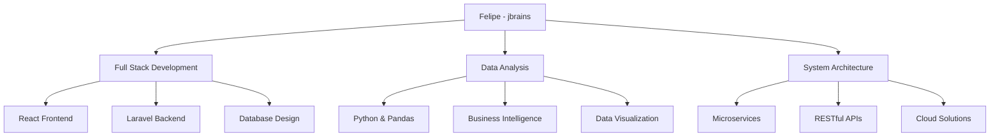

# ¡Hola! Soy **Felipe** 👋

<div align="center">
  
</div>

<div align="center">
  
[](https://git.io/typing-svg)

</div>

<div align="center">
  <a href="https://github.com/Vicharra463">
    
  </a>
  <a href="mailto:felipe.dev@example.com">
    
  </a>
  <a href="https://www.linkedin.com/in/felipe-developer/">
    
  </a>
</div>

---

## 🚀 **Sobre Mí**


🎯 **Ingeniero de Sistemas** especializado en desarrollo **Full Stack**  
💡 **Creador apasionado** de soluciones digitales innovadoras  
🔥 **ID jbrains** - Usuario activo en comunidades de desarrollo  
📈 **Especialista** en análisis de datos y arquitecturas escalables  
🌱 **Lifelong learner** - Siempre explorando nuevas tecnologías  
⚡ **Philosophy:** *"Clean code is not written by following a set of rules. Clean code is written by programmers who care"*

### 🎯 **Actualmente Enfocado En:**
- 🔧 Desarrollo de aplicaciones **React + Laravel**
- 📊 Proyectos de **análisis de datos** con Python
- 🏗️ Arquitecturas **microservicios** y APIs RESTful
- 🚀 **DevOps** y automatización de procesos

---

## 🛠️ **Arsenal Tecnológico**

### 💻 **Core Technologies**

<div align="center">

| **Frontend** | **Backend** | **Database** | **Tools** |
|:------------:|:-----------:|:------------:|:---------:|
|  |  |  |  |
|  |  |  |  |
|  |  |  |  |
|  |  |  |  |

</div>

### 📊 **Skill Levels**

<details>
<summary><b>🔥 Expertise Breakdown</b></summary>

```text
Full Stack Development  ████████████████████████████████████████ 90%
React & Frontend        ████████████████████████████████████████ 85%
Laravel & PHP           ████████████████████████████████████████ 80%
Database Management     ████████████████████████████████████████ 85%
Python & Data Analysis  ████████████████████████████████████████ 75%
Java Development        ████████████████████████████████████████ 80%
DevOps & Deployment     ████████████████████████████████████████ 70%
API Development         ████████████████████████████████████████ 85%
```

</details>

---

## 📈 **GitHub Analytics**

<div align="center">
  
<table>
<tr>
<td width="50%">


</td>
<td width="50%">


</td>
</tr>
</table>

<p align="center">
  
</p>

### 🏆 **Achievements**
<p align="center">
  
</p>

</div>

---

## 🎯 **Proyectos Destacados**

<div align="center">

### 🌟 **Portfolio de Soluciones**

<table>
<tr>
<td align="center" width="33%">

**🚀 Full Stack Apps**
<br>
<sub>Aplicaciones completas React + Laravel</sub>
<br>


</td>
<td align="center" width="33%">

**📊 Data Analytics**
<br>
<sub>Análisis empresarial con Python</sub>
<br>


</td>
<td align="center" width="33%">

**🏗️ Enterprise Systems**
<br>
<sub>Arquitecturas escalables y APIs</sub>
<br>


</td>
</tr>
</table>

### 💡 **Áreas de Especialización**



</div>

---

## 🌐 **Conecta Conmigo**

<div align="center">

### 💬 **Let's Build Something Amazing Together!**

<br>

<a href="https://github.com/Vicharra463">
  
</a>
<br><br>
<a href="mailto:felipeguerrero417@gmail.com">
  
</a>
<br><br>
<a href="https://www.linkedin.com/in/jose-felipe-guerrero-salda%C3%B1a-3ba1261ba/">
  
</a>

<br><br>

### 🎯 **Open to:**
**🤝 Collaborations** • **💼 Opportunities** • **📚 Knowledge Sharing** • **🚀 Innovative Projects**

<br>

[](https://github.com/Vicharra463)

</div>

---

<div align="center">

## 💭 **Philosophy**

*"Code is poetry written in logic. Every function, every algorithm, every solution is an opportunity to create something extraordinary that makes a difference."*

**— Felipe (jbrains)**

<br>


<br>


</div>

---

<div align="center">
  <sub>⭐ From <a href="https://github.com/Vicharra463">Felipe</a> with ❤️ | Last updated: May 2025</sub>
</div>
